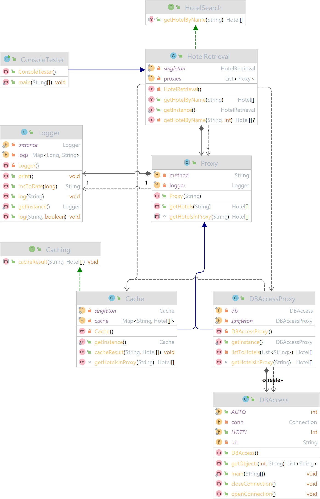
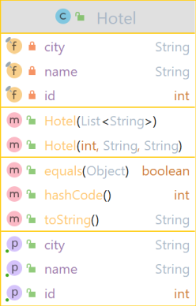

# A1 - Lösung als UML



Die Klasse Hotel wurde für eine bessere Übersicht ausgelagert:



Die Lösung kann mit der Klasse ConsoleTester getestet werden. Weitere Hinweise zur Nutzung findet man in den Unittests.

# Fragen

> 1. Welche Aufgabe haben Ports im Kontext eines Komponentendiagramms?

**Antwort:**

Ports sind spezielle Parts in Komponentendiagrammen. Sie beschreiben einen Interaktionspunkt zwischen dem Classifier
oder einem Part und seiner Umgebung bzw. das Verhalten zwischen dem Classifier und seinen internen Parts. Sie sind
Kommunikationsschnittstellen, die den Classifier nach außen abkapseln.

> 2. Wie könnte man deren Aufgabe für eine Komponente in Java implementieren?

**Antwort:**

Die Aufgabe eines Ports kann in Java beispielsweise durch öffentliche Methoden, auf die von anderen Klassen aus
zugegriffen werden kann, implementiert werden. Mit Hilfe von Interfaces können die Methoden zu Verfügung gestellt
werden.

> 3. Wie können benötigte bzw. angebotene Interfaces injiziert bzw. entnommen werden?

**Antwort:**

Es können sowohl angebotene als auch benötigte Interfaces mit Parts über Ports und Konnektoren verbunden werden.
Angebotene Schnittstellen werden durch einen geschlossenen Kreis und benötigte Schnittstellen durch einen geöffneten
Kreis symbolisiert.

# FA0

> Implementieren sie das Port-Konzept nach den Vorgaben bzw. Überlegungen gemäß (Rupp, 2012). Welches Design Pattern sollte hier verwendet werden, um die notwendige Delegation zwischen internen und externen Verhalten zu realisieren?

__Antwort:__

- [Proxy](https://www.geeksforgeeks.org/proxy-design-pattern/)
- [Singleton](https://www.geeksforgeeks.org/singleton-class-java/)
- [Encapsulated Classifier](https://www.uml-diagrams.org/port.html)
- ~~Adapter~~
- ~~Facade~~

# FA1

> Offensichtlich ist die Ausgabe der Klasse DBAccess nicht sonderlich objektorientiert! Ihre Aufgabe soll es daher sein, die Ausgabe so zu transformieren, dass sie über die öffentliche Schnittstelle der Komponente Buchungssystem nur Objekte vom Typ Hotel zurückliefern. Die Attribute der Klasse Hotel sind entsprechend selber zu bestimmen, die Klasse selber ist in einem separaten Subsystem zu verlagern. Muss das Interface Hotelsuche ggf. noch um weitere Methoden erweitert werden? Beachten sie dazu auch die Tutorial-Ausgabe der Klasse DBAccess! Gibt es eine dedizierte Reihenfolge beim Aufruf der Methoden des Interfaces?

__Antwort:__

Grundsätzlich kommt zur Lösung dieser Aufgabe
das [Proxy Design Pattern](https://www.geeksforgeeks.org/proxy-design-pattern/) zum Einsatz.

Als öffentliche Schnittstelle der Komponente Buchungssystem fungiert die Klasse HotelRetrieval über die Objekte des
Typen Hotel zurückgegeben werden. Über die Schnittstelle können aktuell Hotels über den Hotelnamen gesucht werden.
Weitere Methoden für das Interface sind nicht notwendig, aber es könnte beispielsweise um eine Suche nach der Stadt
erweitert werden.

Die Datenbankschnittstelle DBAccess wird über die Klasse DBAccessProxy aufgerufen, wo zuerst die Verbindung geöffnet
werden muss, bevor eine DB-Abfrage durchgeführt werden kann und schließlich die Verbindung wieder geschlossen wird. Da
es sich bei der Klasse DBAccess um quasi ein externes System handelt, wurde der Code dieser Klasse nicht verändert.

# FA2

> Die Komponente Buchungssystem benötigt ferner eine Referenz vom Typ Caching, mit der die interne Klasse HotelRetrieval die Ergebnisse in einem Cache zwischenspeichern kann. Von außerhalb der Komponente muss also eine entsprechende Referenz erzeugt werden und über den Port injiziert werden. Ist die Schnittstelle Caching hinreichend modelliert oder fehlen auch hier Methoden? Implementieren sie die Implementierung eines konkreten Cache rudimentär.

__Antwort:__

Die Abfragen der Datenbank werden über die Klasse Cache gespeichert. Sowohl die Klasse Cache als auch DBAccessProxy
erben von der abstrakten Klasse Proxy.

Wenn also über die Methode "getHotelByName(String name)" der Klasse HotelRetrieval nach Hotels gesucht wird, wird zuerst
untersucht, ob eine Abfrage nach dem gleichen Suchwort bereits stattgefunden hatte, indem die Liste der Proxies
untersucht wird. Auch hier wird die Methode "getHotelByName()" der Schnittstelle zur DB genutzt.

# FA3

> Überlegen sie auch einen Mechanismus, damit HotelRetrieval stets zumindest scheinbar ohne Probleme (z.B. keine NullPointer Exceptions) auf den Cache zugreifen kann, auch wenn keine konkrete Referenz gesetzt ist. Ein etwaiges Fehlerhandling darf dabei nicht von der Klasse HotelRetrieval übernommen werden.

__Antwort:__

Die Abfrage nach Hotelnamen erfolgt durch die Klasse HotelRetrieval, in die eine Liste an Proxies erzeugt wird - in
unserem Falle Cache und DBAccessProxy. Weitere Proxies können durch den Konstruktor angebunden werden.

Ablauf:

- Ein Client sucht über HotelRetrieval nach Hotels.
- Suche im Cache nach den Hotels.
    - Falls gefunden: Gebe Hotels zurück und **Ablauf beenden**.
    - Falls nicht gefunden: Gebe null an HotelRetrieval zurück.
- Suche über DBAccessProxy nach den Hotels.
    - Falls gefunden:
        - Wandel die Antworten in den Typ Hotel um.
        - Speichere die Hotels im Cache.
        - Gebe die Hotels an HotelRetrieval zurück.
    - Falls nicht gefunden:
        - Speichere die Antwort im Cache: Suchbegriff "Bla" zeigt auf Hotels [] (leer).
        - Gebe ein leeres Array an HotelRetrieval zurück.

Da im Ablauf keine NullPointerExceptions geworden werden, muss auch kein Fehlerhandling betrieben werden.

# FA4

> Realisieren sie zudem eine Logging-Funktionalität, mit der die Zugriffe auf das Interface Hotelsuche geloggt werden. Eine Ausgabe sollte wie folgt sein:
>
> 01.10.22 21:22: Zugriff auf Buchungssystem über Methode getHotelBy- Name. Suchwort: Berg
>
>Auch das Logging ist eine Querschnittsfunktionalität, die nicht in der Klasse HotelRetrieval enthalten sein soll.

__Antwort:__

Das Logging erfolgt durch die abstrakte Klasse Proxy. Jede Klasse die von Proxy erbt, wird automatisch im Logging berücksichtigt.

# FA5

> Ihre gesamten Entwicklungen sollen dann als „deploybare“ Komponente im Format .jar exportiert werden. Testen sie ihre Entwicklungen hinreichend mit einem externen Client (nicht Teil der deploybaren Komponente!).
>
> - Hinweis: bitte an dieser Stelle noch keinen Microservice erzeugen!

__Antwort:__

Wurde mit JUnit umgesetzt. Tests sind in "src/test/java/A1" zu finden. Die deploybare Komponente kann mit dem
Maven-Kommando "mvn package" erstellt werden und ist danach in dem Ordner "target" zu finden.

# FA6

> Eine häufige Forderung an Komponentenmodellen ist die Navigation über vorhandene Schnittstellen einer Komponente (vgl. Kapitel 2, Folie 23). Wie könnte so ein einfacher Navigationsmechanismus aussehen? Erweitern sie das Port-Konzept ihrer Anwendung entsprechend, in dem sie erlauben, dass ein Client bei einem Port über alle verfügbaren „Provided Interfaces“ navigieren kann, um dann in einem nächsten Schritt ein passendes Interface zu wählen. Als Beispiel sollten sie für den „Suche-Port“ zwei Schnittstellen anbieten, der eine einfache und eine erweiterte Suche ermöglicht. Die eigentliche Auswahl auf Client-Seite brauchen sie nicht zu implementieren, sollten aber über Herausforderungen für eine Implementierung kurz diskutieren.

__Antwort:__

Die Klasse HotelRetrieval bietet bereits eine Liste an Proxies. Durch die darin enthaltene Methode getHotelByName(String
name, int level) könnte der Client mit dem Argument level den gewünschten Proxy auswählen - derzeit ist Cache auf level
0 und DBAccessProxy auf 1.

Jedoch müsste die Methode getHotelByName(...) auf public (derzeit private) geändert werden, damit es von außen aufrufbar
ist. Auch ist es nach außen hin nicht ersichtlich, welcher Proxy sich hinter welchem Level befindet. Dies könnte man
lösen, indem man anstatt eines Levels (int) ein vordefiniertes Enum als Argument anfordert.

Pseudo-Code:

```java
class HotelRetrievalBsp {

    // ...Constructor, Instanzvariablen...

    public enum Proxies {
        CACHE, DB_ACCESS_PROXY
    }

    public Hotel[] getHotelByName(String name, Proxies proxy) {
        Hotel[] hotels;
        switch (proxy) {
            case CACHE:
                System.out.println("Suche im CACHE.");
                // ...
                hotels = foundHotels;
                break;

            case DB_ACCESS_PROXY:
                System.out.println("Suche im DB_ACCESS_PROXY.");
                // ...
                hotels = foundHotels;
                break;
        }
        return hotels;
    }
}
```

# R1

> Modellieren sie die resultierenden Klassen und die Abhängigkeiten ihrer gesamten Software als ein Klassendiagramm nach der UML.

__Antwort:__ Siehe oben.
