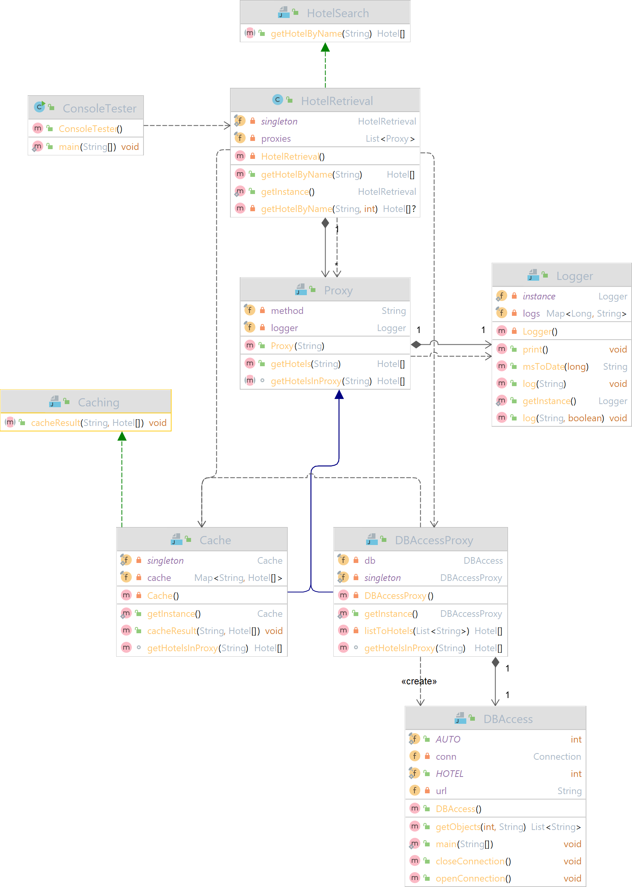

# Fragen

_1. Welche Aufgabe haben Ports im Kontext eines Komponentendiagramms?_

Antwort:
Ports sind spezielle Parts in Komponentendiagrammen. Sie beschreiben einen Interaktionspunkt zwischen dem Classifier
oder einem Part und seiner Umgebung bzw. das Verhalten zwischen dem Classifier und seinen internen Parts. Sie sind
Kommunikationsschnittstellen, die den Classifier nach außen abkapseln.

_2. Wie könnte man deren Aufgabe für eine Komponente in Java implementieren?_

Antwort: Die Aufgabe eines Ports kann in Java beispielsweise durch öffentliche Methoden, auf die von anderen Klassen aus
zugegriffen werden kann, implementiert werden. Mit Hilfe von Interfaces können die Methoden zu Verfügung gestellt werden. 

_3. Wie können benötigte bzw. angebotene Interfaces injiziert bzw. entnommen werden?_

Antwort: Es können sowohl angebotene als auch benötigte Interfaces mit Parts über Ports und Konnektoren verbunden
werden. Angebotene Schnittstellen werden durch einen geschlossenen Kreis und benötigte Schnittstellen durch einen
geöffneten Kreis symbolisiert.

# UML



Die Klasse Hotel wurde für eine bessere Übersicht ausgelagert:


# FA0

_Implementieren sie das Port-Konzept nach den Vorgaben bzw. Überlegungen gemäß
(Rupp, 2012). Welches Design Pattern sollte hier verwendet werden, um die notwendige Delegation zwischen internen und
externen Verhalten zu realisieren?_

__Antwort:__

- Proxy
- Encapsulated Classifier
- Adapter???
- Facade???
- Singleton
- MVC
- Command???

# FA1

_Offensichtlich ist die Ausgabe der Klasse DBAccess nicht sonderlich objektorientiert!
Ihre Aufgabe soll es daher sein, die Ausgabe so zu transformieren, dass sie über die öffentliche Schnittstelle der
Komponente Buchungssystem nur Objekte vom Typ Hotel zurückliefern. Die Attribute der Klasse Hotel sind entsprechend
selber zu bestimmen, die Klasse selber ist in einem separaten Subsystem zu verlagern. Muss das Interface Hotelsuche ggf.
noch um weitere Methoden erweitert werden? Beachten sie dazu auch die Tutorial-Ausgabe der Klasse DBAccess! Gibt es eine
dedizierte Reihenfolge beim Aufruf der Methoden des Interfaces?_

__Antwort:__ Als öffentliche Schnittstelle der Komponente Buchungssystem fungiert die Klasse HotelRetrieval über die Objekte des Typen Hotel zurückgegeben werden.
Über die Schnittstelle können aktuell Hotels über den Hotelnamen gesucht werden. Weitere Methoden für das Interface sind nicht notwendig, aber es könnte beispielsweise
um eine Suche nach der Stadt erweitert werden. Die Datenbankschnittstelle DBAccess wird über die Klasse DBAccessProxy aufgerufen, wo zuerst die Verbindung geöffnet
werden muss, bevor eine DB-Abfrage durchgeführt werden kann und schließlich die Verbindung wieder geschlossen wird.


# FA2

_Die Komponente Buchungssystem benötigt ferner eine Referenz vom Typ Caching, mit der die interne Klasse HotelRetrieval
die Ergebnisse in einem Cache zwischenspeichern kann. Von außerhalb der Komponente muss also eine entsprechende Referenz
erzeugt werden und über den Port injiziert werden. Ist die Schnittstelle Caching hinreichend modelliert oder fehlen auch
hier Methoden? Implementieren sie die Implementierung eines konkreten Cache rudimentär._

__Antwort:__ Die Abfragen der Datenbank werden über die Klasse "Cache" gespeichert. Wenn also über die Methode "GetHotelByName(String name)" der Klasse
HotelRetrieval nach Hotels gesucht wird, wird zuerst untersucht, ob eine Abfrage nach dem gleichen Suchwort bereits stattgefunden hatte indem 
die Liste der Proxies untersucht wird. Auch hier wird die Methode "getHotelByName()" der Schnittstelle zur DB genutzt.  

# FA3

_Überlegen sie auch einen Mechanismus, damit HotelRetrieval stets zumindest scheinbar ohne Probleme (z.B. keine
NullPointer Exceptions) auf den Cache zugreifen kann, auch wenn keine konkrete Referenz gesetzt ist. Ein etwaiges
Fehlerhandling darf dabei nicht von der Klasse HotelRetrieval übernommen werden._

__Antwort:__ Wenn nach einem Hotelnamen gesucht wird, wird in jedem Fall der Cache nach Treffern untersucht. Falls nichts im Cache 
zu finden ist oder es keinen Treffer in der DB gibt, wird "null" als String zurückgegeben (über die Klasse java.util.Arrays).

# FA4

_Realisieren sie zudem eine Logging-Funktionalität, mit der die Zugriffe auf das Interface Hotelsuche geloggt werden.
Eine Ausgabe sollte wie folgt sein:_

```
01.10.22 21:22: Zugriff auf Buchungssystem über Methode getHotelBy-
Name. Suchwort: Berg
```

_Auch das Logging ist eine Querschnittsfunktionalität, die nicht in der Klasse HotelRetrieval enthalten sein soll._

__Antwort:__ done

# FA5

_Ihre gesamten Entwicklungen sollen dann als „deploybare“ Komponente im Format .jar exportiert werden. Testen sie ihre
Entwicklungen hinreichend mit einem externen Client (nicht Teil der deploybaren Komponente!)._

_- Hinweis: bitte an dieser Stelle noch keinen Microservice erzeugen!_

__Antwort:__ Wurde mit JUnit umgesetzt. Tests sind in "src/test/java/A1" zu finden. Die deploybare Komponente kann mit dem Maven-Kommando "mvn package" erstellt
werden und ist danach in dem Ordner "target" zu finden.

# FA6

_Eine häufige Forderung an Komponentenmodellen ist die Navigation über vorhandene Schnittstellen einer Komponente (vgl.
Kapitel 2, Folie 23). Wie könnte so ein einfacher Navigationsmechanismus aussehen? Erweitern sie das Port-Konzept ihrer
Anwendung entsprechend, in dem sie erlauben, dass ein Client bei einem Port über alle verfügbaren „Provided Interfaces“
navigieren kann, um dann in einem nächsten Schritt ein passendes Interface zu wählen. Als Beispiel sollten sie für den
„Suche-Port“ zwei Schnittstellen anbieten, der eine einfache und eine erweiterte Suche ermöglicht. Die eigentliche
Auswahl auf Client-Seite brauchen sie nicht zu implementieren, sollten aber über Herausforderungen für eine
Implementierung kurz diskutieren._

__Antwort:__ Die angebotenen Schnittstellen (Ports) der Komponente Buchungssystem sind die einfache und die erweiterte Hotelsuche.
Man könnte alle verfügbaren "provided Interfaces" (einfache Suche, erweiterte Suche nach zb Ort) als Menge von Strings ausgeben,
die vom Client zur Navigation genutzt werden kann. Eine Basisklasse für alle Suchfunktionen kann über einen Proxy eine Liste aller möglichen Suchfunktionen
zurückgeben.

# R1

_Modellieren sie die resultierenden Klassen und die Abhängigkeiten ihrer gesamten Software als ein Klassendiagramm nach
der UML._

_Bitte laden sie als Ergebnis die Source Codes, das .jar File sowie kurze Antworten zu den obigen Fragen (wenn
vorhanden)
auf LEA hoch. Als Alternative können sie den Source Code auf ein eigenes öffentliches GitHub-Repository bereitstellen
und den Link dazu auf LEA hochladen (z.B. in einer readme-Datei). Die Antworten zu den Fragen sollten als PDF
bereitgestellt werden._
