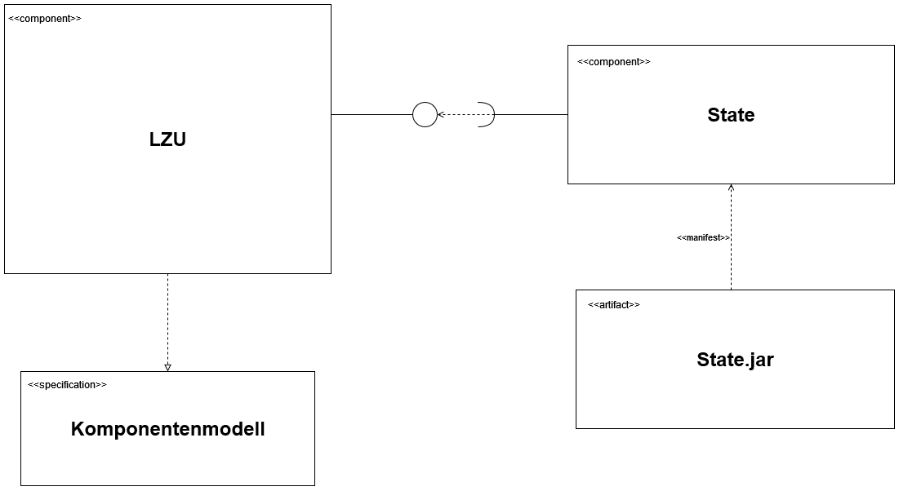

# A3

Für die die Übung 3 wurde die LZU der Übung 2 (siehe Package [A2](../A2)) stark überarbeitet.

Die wichtigsten Änderungen:

- Zuvor war das [CLI](../A2/CLI.java) innerhalb des [ComponentAssembler](../A2/ComponentAssembler.java)'s. Nun sind
  beide
  getrennt.
- Die einzelnen Components laufen nun parallel zum CLI/ComponentAssembler. Zuvor wurden CLI/ComponentAssembler pausiert,
  sobald ein Thread/Runnable eines Component gestartet wurde. Die Pausierung erfolgte durch _thread.join()_;
- Der [ComponentAssembler](../A2/ComponentAssembler.java) erzeugt nun über einen Konstruktor des Component eine Instanz.
  Zuvor wurde nur eine static main Methode einer Component aufgerufen.
- Das Auswahlmenü (im [CLI](../A2/CLI.java)) wurde entsprechend der neuen Change Requests der Übung 3 erweitert.

## 4-Sichten-Modell



## Change Requests

> CR1: Die aktuelle Konfiguration einer Laufzeitumgebung (welche Komponenten wurden in welcher Reihenfolge eingesetzt)
> soll stets persistent auf einem externen Server abgespeichert werden, so dass bei einem Absturz der lokalen
> Laufzeitumgebung der Zustand (= die Konfiguration) der Laufzeitumgebung wiederhergestellt werden kann.

In der Struktur unserer LZU werden die Informationen nicht im [ComponentAssembler](../A2/ComponentAssembler.java)
hinterlegt, sondern in den einzelnen [Component](../A2/Component.java)'s selbst - darunter fallen
Informationen wie der Status oder Timestamps. Daher haben wir uns entschieden die Components (als _Component[]_) zu
persistieren.

Für die Persistierung wird die freie Library [XStream](https://x-stream.github.io/index.html) genutzt, welches die
Möglichkeit bietet ein beliebiges Objekt zu serialisieren (in eine XML Format zu bringen) und zu deserialisieren (das
XML Format in die ursprüngliche Form zu zurückzuwandeln).

Als Hilfsklasse dient der [VersionControl](VersionControl.java), welches
vom [ComponentAssembler](../A2/ComponentAssembler.java) genutzt wird.

Die gespeicherten Save-Dateien befinden sich [hier](../A2/saves).

Im [CLI](../A2/CLI.java) wurden die Menüpunkte 5 und 6 neu hinzugefügt:

```
Start Component Assembler CLI
----------------------------------------
Please select:
[0] show status
[1] load component
[2] unload component
[3] start component
[4] stop component
[5] serialize
[6] deserialize
[7] exit
6
Please select save file to load
[0] src\main\java\A2\saves\save_1652040519795.xml < latest
[1] back
0
----------------------------------------
A new thread has been added.
id: 26562209
component: State.jar
class: State
created: 08.05.2022 22:08:20:557 +0200
active: false
----------------------------------------
A new thread has been added.
id: 199336425
component: State.jar
class: State
created: 08.05.2022 22:08:28:854 +0200
active: false
----------------------------------------
```

> CR2: Erweitern sie ihre Laufzeitumgebung um einen horizontalen Logging-Dienst, der von ihrer Laufzeitumgebung für alle
> kompatiblen Komponenten angeboten werden soll.

Die Injektion des Loggers erfolgt nach der Instanziierung der Komponente über Reflection, sodass auf eine 
Setter-Methode verzichtet werden kann.

**Siehe:**

- [Component](Component.java)

```
void inject(Object object){
    Class<?> c = object.getClass();
    for (Field field: c.getDeclaredFields()) {
        if (field.isAnnotationPresent(A3.Inject.class)){
            try {
                field.set(object, new Logger());
            }
            catch (Exception e){
                System.err.println("Error injecting Object: " + e.getMessage());
            }
        }
    }
}
```

- [Inject](Inject.java)
- [Logger](Logger.java)
- [LoggerFactory](LoggerFactory.java)

