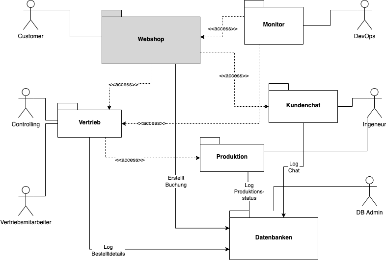

# A4

## a)

Gehen sie auf die o.g. Statements kritisch ein und beantworten sie die aufgeführten Fragen in 2-3 Sätzen. Die
resultierenden Erkenntnisse können sie natürlich später gerne in die Architektur einfließen lassen. Beachten sie dabei
auch die Erläuterungen aus der Architekturbeschreibung. Zur Diskussion der Vor- und Nachteile von Komponenten-,
Schicht- und Funktionsteams empfehle ich den Artikel von Unterauer (2017), siehe Verzeichnis „Literatur zu Kapitel 4“.

Zur Diskussion des Statements Nr. 4 empfehle ich folgenden Artikel von Sam Newmann:

http://samnewman.io/patterns/architectural/bff/ (Last Access: 08.05.2022)

> Statement Nr. 1:
>
> „Wir haben eine strenge Komponenten- und Schichtenbildung, entsprechend haben wir auch Komponenten- und
> Schichtenteams. Das kann nur Vorteile haben, das wird übernommen!“! Nach kurzer Diskussion beruht man auch für
> Microservices auf diese Einteilung und verspricht sich dadurch einen klaren Vorteil. Was denken sie dazu? Was würde
> sie dem Unternehmen eher empfehlen?

Die horizontale Aufteilung in Schichten und deren Teams ist für Microservices nicht geeignet. Microservices erfordern
eine vertikale Aufteilung in Teams für die einzelnen Microservices, die alle Schichten überspannen.

> Statement Nr. 2:
>
> „Das wird schon! Die Geschäftsführung des Unternehmens muss doch für so
> eine geringfügige Architekturänderung nicht informiert werden.“ Was denken sie über dieses Statement?

Die Änderung in der Architektur ist keineswegs geringfügig. Für die Umstellung auf eine Microservice-Struktur sind
umfangreiche Änderungen nicht nur an der Architektur, sondern auch bei der Verteilung der Teams nötig.

Die Geschäftsführung sollte bei diesem Unterfangen auf jeden Fall mit ins Boot geholt werden.

> Statement Nr. 3:
>
> „Wir können doch schon Cloud–wir sind cloud-ready!“! Da man die Anwendungsschicht auf einer Virtuellen
> Maschine (VM) deployed hat, resultiert man konsequenterweise, dass diese VM auch einfach auf einen Cloud-Anbieter (
> z.B. AmazonWS) ausgelagert werden kann. Die Anwendung gilt somit als skalierbar! Es besteht eh keine Notwendigkeit der
> Skalierung einzelner Komponenten, so die Bereichsleitung. Wie stehen sie zu diesem Urteil?

Das bloße deployen auf einer VM bedeutet nicht, dass die Anwendung auch skalierbar ist. Zudem ist bei einer
Unterteilung in Microservices die Skalierung einzelner Komponenten nötig, da jeder Microservice seine eigene
Anwendungsschicht besitzt.

> Statement Nr. 4:
>
>„Ach immer dieses API-Team...“. Das „API-Team“ (vgl. Baustein-Sicht) hat sich wohl in letzter Zeit oft
> über eine zunehmende Komplexität der Komponente „GP-API“ aus dem Presentation Logic Layer beschwert, gibt aber
> Begründungen nicht explizit an (--man gibt zu, vielleicht auch nicht richtig hingehört zu haben...). Was für Gründe
> könnten das sein aus ihrer Sicht? Wie könnte man diese Schicht ggf. im Rahmen der Microservice-Architektur optimieren?

Da die UI-Komponenten unterschiedliche Aufgaben haben, führen sie auch unterschiedliche Aufrufe an die API durch,
wodurch die Komplexität steigt. Die Webbrowser-Komponente erlaubt mehr Aufrufe als die Mobile App und der
Desktop-Client macht ganz andere API-Aufrufe als die beiden anderen Komponenten.

Eine Lösung nach Newman wäre, die Verwendung einer BFF (Backend For Frontend) Komponenten für jede der UI-Komponenten.
Dies führt zu mehreren überschaubaren Komponenten statt einer komplexen General-Purpose API.

> Statement Nr. 5:
>
> „Die Analyse-Komponente ist DAS Problem überhaupt!“! Leider sorgt die Analyse-Komponente innerhalb der
> Komponente „Manufacturing Products“ häufig für Probleme während der Konstruktion von Produkten (siehe Erläuterungen in
> Dokument). Was sind hier konkret die Probleme? Wie sähe eine mögliche Lösungsstrategie aus?

Lösungsansätze:

- Single Responsibility: Analyse-Komponente aus "Manufactoring Product" auslagern.
- Parallelität statt sequenzielle Arbeitsschritte
- Benutzung eines Caches
- Mehr Hardware Resourcen nutzen
- Code Optimierung: Kann der Code performanter laufen?

> Statement Nr. 6:
>
> „Unsere langfristige Strategie: ein globales und universales Datenmodell!“! Da man auch immer noch
> diverse Bestandsysteme verwendet (SAP ERP, Oracle CRM), sieht man die Etablierung eines gemeinsamen
> universalen Datenmodells als unabdingbar. Was denken sie? Wie würden sie hier mit den heterogenen Datenmodellen
> umgehen? Wird diese Meinung von allen Entwicklerteams mitgetragen?

Ein gemeinsames Datenmodel ist nicht ratsam für ein Microservice Model, da es zu große Abhängigkeiten erzeugt. Die
Microservices sollen unabhängig voneinander laufen können - so auch deren Datenmodelle. Durch die Trennung der
Datenmodelle wird auch das Risiko von unvorhersehbaren Problemen verteilt. Fällt ein Datenmodel aus können die anderen
noch weiterlaufen.

> Statement Nr. 7:
>
> „Das Entwicklungsteam will ja unbedingt ein Monitoring. Warum das bitte?? Zu teuer und wenig
> aussagekräftig. Das lassen wir mal!“. Was sind aus ihrer Sicht die Vorteile einer Monitoring-Komponente? Gibt es
> Herausforderungen?

Nach außen hin mag es als wenig aussagekräftig erscheinen. Jedoch wurde nicht berücksichtigt, dass die Wartung der
Software hohe Kosten verursachen kann/wird. Am Ende läge der Aufwand bei den oben beschriebenen Entwicklern.

Das Monitoring ist ein wichtiger Bestandteil zur Wartung einer produktiven Software. So können frühzeitig Probleme
erkannt werden, bevor diese zu einem operativen Risiko heranwachsen, wie beispielsweise Performance Probleme, die bis
hin zu einem Crash der Software führen können. Wichtige Monitoring Features wie beispielsweise ein Notification System,
dienen dazu den Aufwand der Wartung zu minimieren - das heißt mit einem gut durchdachten Monitoring können kurz- bis
spätestens mittelfristig laufende Kosten gespart werden.

## b)

> Modellieren sie eine erste Version einer neuen Software-Architektur auf Basis des Architekturstils Microservices.
> Modellieren sie eine Kontext-Sicht sowie eine Baustein- Sicht (vgl. Kapitel 3, Abschnitt 2). Falls schon anwendbar,
> können sie auch eine erste Verteilungssicht modellieren. Sie können sich bei der Baustein-Sicht gerne an die
> allgemeinen
> Erläuterungen zu Microservices aus Kapitel 2 (Abschnitt Microservices) sowie an die in Kapitel 3 (Abschnitt 4)
> orientieren. Modellieren sie auch eine erste Context Map (vgl. Kapitel 2 (Abschnitt Microservices))!
>
> Bei der Modellierung der Sichten sollten sie sich zudem an die abgeleiteten Lösungen für alle Architecture Smells (
> Abschnitt IV.A) sowie für alle Anti Patterns (Abschnitt IV.B) aus dem Katalog von (Schirgi and Brenner, 2021)
> orientieren! Geben sie für jede Lösung eines Anti Patterns bzw. eines Architecture Smells eine erste Einschätzung ab,
> inwiefern diese für ihren ersten Architektur-Entwurf relevant sind und wie sie die Lösungen in die
> Software-Architektur
> integrieren konnten. Geben sie auch eine erste Einschätzung hinsichtlich Priorisierung, Aufwand sowie Implikationen
> für
> die spätere Implementierung einer jeden Lösung ab (vgl. ähnliche Herleitung wie bei der LZU, Übung Nr. 2).
>
> Bei der Kontext-Sicht sollten auch die verschiedenen Akteure der Anwendung herauskommen. Sind die Akteure in der
> bestehenden IST-Architektur alle berücksichtigt worden? Tipp: Fokussieren sie sich bei der Baustein-Sicht sowie bei
> der
> Context Map auf die Komponente „Manufacturing Products“ – hier finden sie auch einige Hinweise dazu in der
> Architekturbeschreibung.

### Kontext-Sicht

---------------

### Architectural Smells

#### Hard-Coded Endpoints

Wird aktuell noch nicht berücksichtigt.

#### Shared Persistence

Jeder Service besitzt eine eigene Datenbank.

#### Independent Deployability

Wird aktuell noch nicht berücksichtigt.

#### Horizontal Scalability

Wird aktuell noch nicht berücksichtigt.

#### Isolation of failures

Wird aktuell noch nicht berücksichtigt.

#### Decentralization

In der aktuellen Planung ist die Management Komponente getrennt von den anderen Komponenten und kann somit unabhängig
deployt werden.

---------------

### Design Anti-pattern

#### Wrong Cut

Wird aktuell noch nicht berücksichtigt.

#### Cyclic Dependencies

Es existieren keine Cyclic Dependencies.

#### Nano Service

Nach unserer Einschätzung existieren keine Nano Services. Während der Entwicklung wird die Größe eines Services
konkret. Auch dann noch kann überlegt werden ob Services getrennt oder zusammengefasst werden.

#### Mega Service

Nach unserer Einschätzung existieren keine Mega Services. Während der Entwicklung wird die Größe eines Services
konkret. Auch dann noch kann überlegt werden ob Services getrennt oder zusammengefasst werden.

#### Shared Libraries

Wird aktuell noch nicht berücksichtigt.

#### Too many standards

Wird aktuell noch nicht berücksichtigt.

#### Too new technology

Wird aktuell noch nicht berücksichtigt.

#### Manual Anti-pattern

Wird aktuell noch nicht berücksichtigt.

#### No Continuous Integration (CI) / Continuous Delivery (CD)

Wird aktuell noch nicht berücksichtigt.

#### No API Gateway

Wird aktuell noch nicht berücksichtigt.

#### Timeouts

Wird aktuell noch nicht berücksichtigt.

#### No API Versioning

Wird aktuell noch nicht berücksichtigt.

#### No Health Check

Der Health Check soll ein Teil der Monitor Komponente werden.

#### Local Logging

Ein zentrale Logging Komponente wurde berücksichtigt.

#### Insufficient Monitoring

Soll in der Monitor-Komponente berücksichtigt werden.